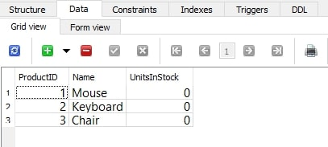
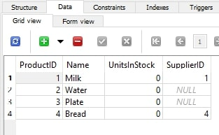
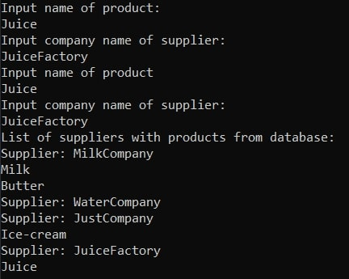
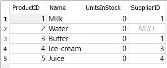
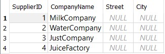
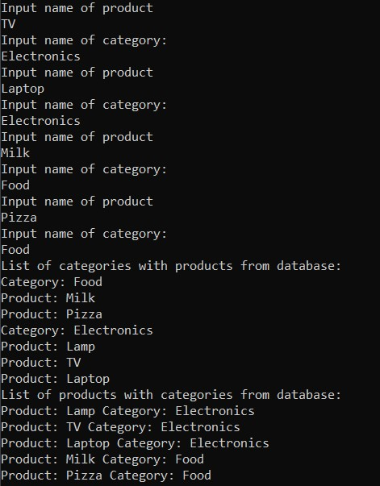
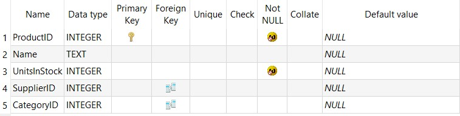
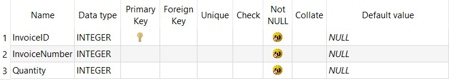
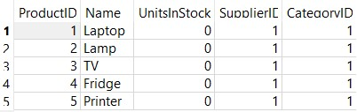
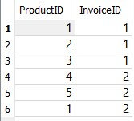

# Entity Framework
#### Author: Uladzislau Tumilovich

## Sprawozdanie

**Zadanie 1**

Stworzyłem projekt lTumilovichProductEF i dodałem klasę Product z polami int ProductID, string Name, int UnitsInStock

**Product class**
``` yaml
class Product
{
    public int ProductID { get; set; }
    public string Name { get; set; }
    public int UnitsInStock { get; set; }
}
```

Dalej stworzyłem klasę ProdContext dziedziczącą po DbContext.

**ProdContext class**
``` yaml
class ProdContext:DbContext
{
    public DbSet<Product> Products { set; get; }

    protected override void OnConfiguring(DbContextOptionsBuilder optionsBuilder) =>
        optionsBuilder.UseSqlite("DataSource=Product.db");
}
```

Następnie w klasie Program dodałem metodę AddProduct, która dodaje produkt do bazy i metodę PrintProductNames, która wyświetla nazwy produktów z bazy. Na koniec wyzywam tę metody w metodzie Main.

**Program class**
``` yaml
class Program
{
    private static void AddProduct(ProdContext prodContext)
    {
        Console.WriteLine("Input name of product:");
        String prodName = Console.ReadLine();

        Product product = new Product();
        product.Name = prodName;

        prodContext.Products.Add(product);
        prodContext.SaveChanges();
    }

    private static void PrintProductsNames(ProdContext prodContext)
    {
        Console.WriteLine("List of products names from database:");
        var query = from p in prodContext.Products
                    select p.Name;

        foreach (var item in query)
        {
            Console.WriteLine(item);
        }
    }

    static void Main(string[] args)
    {
        ProdContext prodContext = new ProdContext();

        AddProduct(prodContext);
        PrintProductsNames(prodContext);
    }
}
```

Wynik działania programu


Wygląd tabeli Products


Select z tabeli Product



**Zadanie 2**

W drugim punkcie zmodyfikowałem kod z pierwszego punktu dodaniem klasy Supplier

**Supplier class**
``` yaml
class Supplier
{
    public int SupplierID { get; set; }
    public String CompanyName { get; set; }
    public String Street { get; set; }
    public String City { get; set; }
}
```

Zmodyfikowałem klasę Product dodaniem klucza obcego Supplier

**Product class**
``` yaml
class Product
{
    public int ProductID { get; set; }
    public string Name { get; set; }
    public int UnitsInStock { get; set; }
    public Supplier Supplier { get; set; }
}
```

W klasie ProdContext dodałem set Supplierów

**ProdContext class**
``` yaml
class ProdContext:DbContext
{
    public DbSet<Product> Products { set; get; }
    public DbSet<Supplier> Suppliers { set; get; }

    protected override void OnConfiguring(DbContextOptionsBuilder optionsBuilder) =>
        optionsBuilder.UseSqlite("DataSource=Product.db");
}
```

Na koniec dodałem metody AddSupplier, PrintSuppliersCompaniesNames,  ConnectProductSupplier, PrintProductsWithSuppliers i zmodyfikowałem metodę Main klasy Program

**Program class**
```` yaml
class Program
{
    private static void AddProduct(ProdContext prodContext)
    {
        Console.WriteLine("Input name of product:");
        String prodName = Console.ReadLine();

        Product product = new Product();
        product.Name = prodName;

        prodContext.Products.Add(product);
        prodContext.SaveChanges();
    }

    private static void AddSupplier(ProdContext prodContext)
    {
        Console.WriteLine("Input company name of supplier:");
        String companyName = Console.ReadLine();

        Supplier supplier = new Supplier();
        supplier.CompanyName = companyName;

        prodContext.Suppliers.Add(supplier);
        prodContext.SaveChanges();
    }

    private static void ConnectProductSupplier(ProdContext prodContext)
    {
        Console.WriteLine("Input name of product");
        String prodName = Console.ReadLine();
        Product product = prodContext.Products.Where(p => p.Name == prodName).FirstOrDefault();

        Console.WriteLine("Input company name of supplier:");
        String companyName = Console.ReadLine();
        Supplier supplier = prodContext.Suppliers.Where(s => s.CompanyName == companyName).FirstOrDefault();

        product.Supplier = supplier;
        prodContext.SaveChanges();         
    }

    public static void PrintProductsWithSuppliers(ProdContext prodContext)
    {
        Console.WriteLine("List of products with suppliers from database:");

        foreach (Product item in prodContext.Products)
        {
            prodContext.Entry(item).Reference(prod => prod.Supplier).Load();

            if (item.Supplier != null)
            {
                Console.WriteLine(item.Name + " " + item.Supplier.CompanyName);
            }
            else
            {
                Console.WriteLine(item.Name);
            }
        }
    }

    private static void PrintProductsNames(ProdContext prodContext)
    {
        Console.WriteLine("List of products names from database:");
        var query = from p in prodContext.Products
                    select p.Name;

        foreach (var item in query)
        {
            Console.WriteLine(item);
        }
    }

    private static void PrintSuppliersCompaniesNames(ProdContext prodContext)
    {
        Console.WriteLine("List of suppliers companies names from database:");
        var query = from s in prodContext.Suppliers
                    select s.CompanyName;

        foreach (var item in query)
        {
            Console.WriteLine(item);
        }
    }

    static void Main(string[] args)
    {
        ProdContext prodContext = new ProdContext();

        AddProduct(prodContext);
        PrintProductsNames(prodContext);

        AddSupplier(prodContext);
        PrintSuppliersCompaniesNames(prodContext);

        PrintProductsWithSuppliers(prodContext);

        ConnectProductSupplier(prodContext);

        PrintProductsWithSuppliers(prodContext);
    }
}
````

Wynik działania programu


Wygląd tabeli Products


Wygląd tabeli Suppliers


Select z tabeli Product



Select z tabeli Suppliers


**Zadanie 3**

W trzecim punkcie odwróciłem relacje tabel Product i Suppliers przez usunięcie pola Supplier z klasy Products i dodaniem listy Produktów w klasie Suppliers

**Product class**
``` yaml
class Product
{
    public int ProductID { get; set; }
    public string Name { get; set; }
    public int UnitsInStock { get; set; }
}
```

**Supplier class**
``` yaml
class Supplier
{
    public Supplier()
    {
        Products = new List<Product>();
    }

    public int SupplierID { get; set; }
    public String CompanyName { get; set; }
    public String Street { get; set; }
    public String City { get; set; }
    public List<Product> Products { get; set; }
}
```

Na koniec dodałem do klasy Program metodę PrintSuppliersWithProducts oraz zmodyfikowałem metody ConnectProductSupplier i Main.

**Program class**
``` yaml
class Program
{
    private static void AddProduct(ProdContext prodContext)
    {
        Console.WriteLine("Input name of product:");
        String prodName = Console.ReadLine();

        Product product = new Product();
        product.Name = prodName;

        prodContext.Products.Add(product);
        prodContext.SaveChanges();
    }

    private static void AddSupplier(ProdContext prodContext)
    {
        Console.WriteLine("Input company name of supplier:");
        String companyName = Console.ReadLine();

        Supplier supplier = new Supplier();
        supplier.CompanyName = companyName;

        prodContext.Suppliers.Add(supplier);
        prodContext.SaveChanges();
    }

    private static void ConnectProductSupplier(ProdContext prodContext)
    {
        Console.WriteLine("Input name of product");
        String prodName = Console.ReadLine();
        Product product = prodContext.Products.Where(p => p.Name == prodName).FirstOrDefault();

        Console.WriteLine("Input company name of supplier:");
        String companyName = Console.ReadLine();
        Supplier supplier = prodContext.Suppliers.Where(s => s.CompanyName == companyName).FirstOrDefault();

        supplier.Products.Add(product);
        prodContext.SaveChanges();         
    }

    public static void PrintSuppliersWithProducts(ProdContext prodContext)
    {
        Console.WriteLine("List of suppliers with products from database:");

        var data = prodContext.Suppliers.Include(s => s.Products).ToList();
        foreach (var s in data)
        {
            Console.WriteLine("Supplier: " + s.CompanyName);
            foreach (var p in s.Products)
            {
                Console.WriteLine(p.Name);
            }
        }
    }

    static void Main(string[] args)
    {
        ProdContext prodContext = new ProdContext();

        AddProduct(prodContext);
        AddSupplier(prodContext);

        ConnectProductSupplier(prodContext);

        PrintSuppliersWithProducts(prodContext);
    }
}
```

Wynik działania programu



Wygląd tabeli Products


Wygląd tabeli Suppliers


Select z tabeli Product



Select z tabeli Suppliers




**Zadanie 4**

W czwartym punkcie dla otrzymania relacji dwustronnej dodałem pole Supplier w klasie Product

**Product class**
``` yaml
class Product
{
    public int ProductID { get; set; }
    public string Name { get; set; }
    public int UnitsInStock { get; set; }
    public Supplier Supplier { get; set; }
}
```

Następnie zmodyfikowałem klasę Program dla wizualizacji programu

**Program class**
``` yaml
class Program
{
    private static void AddProduct(ProdContext prodContext)
    {
        Console.WriteLine("Input name of product:");
        String prodName = Console.ReadLine();

        Product product = new Product();
        product.Name = prodName;

        prodContext.Products.Add(product);
        prodContext.SaveChanges();
    }

    private static void AddSupplier(ProdContext prodContext)
    {
        Console.WriteLine("Input company name of supplier:");
        String companyName = Console.ReadLine();

        Supplier supplier = new Supplier();
        supplier.CompanyName = companyName;

        prodContext.Suppliers.Add(supplier);
        prodContext.SaveChanges();
    }

    private static void ConnectProductSupplier(ProdContext prodContext)
    {
        Console.WriteLine("Input name of product");
        String prodName = Console.ReadLine();
        Product product = prodContext.Products.Where(p => p.Name == prodName).FirstOrDefault();

        Console.WriteLine("Input company name of supplier:");
        String companyName = Console.ReadLine();
        Supplier supplier = prodContext.Suppliers.Where(s => s.CompanyName == companyName).FirstOrDefault();

        supplier.Products.Add(product);
        product.Supplier = supplier;
        prodContext.SaveChanges();         
    }

    public static void PrintSuppliersWithProducts(ProdContext prodContext)
    {
        Console.WriteLine("List of suppliers with products from database:");

        var data = prodContext.Suppliers.Include(s => s.Products).ToList();
        foreach (var s in data)
        {
            Console.WriteLine("Supplier: " + s.CompanyName);
            foreach (var p in s.Products)
            {
                Console.WriteLine(p.Name);
            }
        }
    }

    public static void PrintProductsWithSuppliers(ProdContext prodContext)
    {
        Console.WriteLine("List of products with suppliers from database:");

        foreach (Product item in prodContext.Products)
        {
            prodContext.Entry(item).Reference(prod => prod.Supplier).Load();

            if (item.Supplier != null)
            {
                Console.WriteLine(item.Name + " " + item.Supplier.CompanyName);
            }
            else
            {
                Console.WriteLine(item.Name);
            }
        }
    }

    static void Main(string[] args)
    {
        ProdContext prodContext = new ProdContext();

        AddProduct(prodContext);
        AddSupplier(prodContext);

        ConnectProductSupplier(prodContext);

        PrintSuppliersWithProducts(prodContext);
        PrintProductsWithSuppliers(prodContext);
    }
}
```

Wynik działania programu


Wygląd tabeli Products


Wygląd tabeli Suppliers


Select z tabeli Product


Select z tabeli Suppliers


**Zadanie 5**

W piątym punkcie dodałem klasę Category z polami CategoryID, Name, oraz listą Produktów

**Category class**
``` yaml
class Category
{
    public Category()
    {
        Products = new List<Product>();
    }
    public int CategoryID { get; set; }
    public String Name { get; set; }
    public List<Product> Products { get; set; }
}
```

Następnie dodałem set Categories w klasie ProdContext

**ProdContext class**
``` yaml
class ProdContext:DbContext
{
    public DbSet<Product> Products { set; get; }
    public DbSet<Supplier> Suppliers { set; get; }
    public DbSet<Category> Categories { set; get; }

    protected override void OnConfiguring(DbContextOptionsBuilder optionsBuilder) =>
        optionsBuilder.UseSqlite("DataSource=Product.db");
}
```

Zmodyfikowałem klasę Product przez dodanie pola Category

**Product class**
``` yaml
class Product
{
    public int ProductID { get; set; }
    public string Name { get; set; }
    public int UnitsInStock { get; set; }
    public Supplier Supplier { get; set; }
    public Category Category { get; set; }
}
```

I na koniec do klasy Program dodałem pomocnicze metody - AddCategory, ConnectProductCategory, PrintCategoriesWithProducts, PrintProductsWithCategories oraz zmodyfikowałem metodę Main dla uruchomienia programu

**Program class**
```` yaml
class Program
{
    private static void AddProduct(ProdContext prodContext)
    {
        Console.WriteLine("Input name of product:");
        String prodName = Console.ReadLine();

        Product product = new Product();
        product.Name = prodName;

        prodContext.Products.Add(product);
        prodContext.SaveChanges();
    }

    private static void AddCategory(ProdContext prodContext)
    {
        Console.WriteLine("Input name of Category:");
        String categoryName = Console.ReadLine();

        Category category = new Category();
        category.Name = categoryName;

        prodContext.Categories.Add(category);
        prodContext.SaveChanges();
    }

    private static void ConnectProductCategory(ProdContext prodContext)
    {
        Console.WriteLine("Input name of product");
        String prodName = Console.ReadLine();
        Product product = prodContext.Products.Where(p => p.Name == prodName).FirstOrDefault();

        Console.WriteLine("Input name of category:");
        String categoryName = Console.ReadLine();
        Category category = prodContext.Categories.Where(c => c.Name == categoryName).FirstOrDefault();

        category.Products.Add(product);
        product.Category = category;
        prodContext.SaveChanges();
    }

    private static void PrintCategoriesWithProducts(ProdContext prodContext)
    {
        Console.WriteLine("List of categories with products from database:");

        var data = prodContext.Categories.Include(c => c.Products).ToList();
        foreach (var c in data)
        {
            Console.WriteLine("Category: " + c.Name);
            foreach (var p in c.Products)
            {
                Console.WriteLine("Product: " + p.Name);
            }
        }
    }

    private static void PrintProductsWithCategories(ProdContext prodContext)
    {
        Console.WriteLine("List of products with categories from database:");

        foreach (Product item in prodContext.Products)
        {
            prodContext.Entry(item).Reference(prod => prod.Category).Load();

            if (item.Category != null)
            {
                Console.WriteLine("Product: " + item.Name + " Category: " + item.Category.Name);
            }
            else
            {
                Console.WriteLine("Product: " + item.Name);
            }
        }
    }

    static void Main(string[] args)
    {
        ProdContext prodContext = new ProdContext();

        for (int i = 0; i < 5; i++)
        {
            AddProduct(prodContext);
        }

        for (int i = 0; i < 2; i++)
        {
            AddCategory(prodContext);
        }

        for (int i = 0; i < 5; i++)
        {
            ConnectProductCategory(prodContext);
        }

        PrintCategoriesWithProducts(prodContext);
        PrintProductsWithCategories(prodContext);
    }
}
````

Wynik działania programu



Wygląd tabeli Products


Wygląd tabeli Categories


Select z tabeli Product


Select z tabeli Categories


**Zadanie 6**

W szóstym punkcie razem z nową klasą Invoice dodałem pomocniczą klasę InvoiceProduct, która będzie przechowywała relację wielu do wielu tabel Product i Invoice

**InvoiceProduct class**
``` yaml
class InvoiceProduct
{
    public int ProductID { get; set; }
    public Product Product { get; set; }
    public int InvoiceID { get; set; }
    public Invoice Invoice { get; set; }
}
```

**Invoice class**
``` yaml
class Invoice
{
    public Invoice()
    {
        InvoiceProducts = new List<InvoiceProduct>();
    }
    public int InvoiceID { get; set; }
    public int InvoiceNumber { get; set; }
    public int Quantity { get; set; }
    public List<InvoiceProduct> InvoiceProducts { get; set; }
}
```

Zmodyfikowałem klasę Product przez dodanie listy typu InvoiceProduct

**Product class**
``` yaml
class Product
{
    public Product()
    {
        InvoiceProducts = new List<InvoiceProduct>();
    }
    public int ProductID { get; set; }
    public string Name { get; set; }
    public int UnitsInStock { get; set; }
    public Supplier Supplier { get; set; }
    public Category Category { get; set; }
    public List<InvoiceProduct> InvoiceProducts { get; set; }
}
```

Następnie zmodyfikowałem klasę ProdContext przez dodanie dodatkowych setów Invoices i InvoiceProducts. Dodatkowo nadpisałem metodę OnModelCreating

**ProdContext class**
```` yaml
class ProdContext:DbContext
{
    public DbSet<Product> Products { set; get; }
    public DbSet<Supplier> Suppliers { set; get; }
    public DbSet<Category> Categories { set; get; }
    public DbSet<Invoice> Invoices { set; get; }
    public DbSet<InvoiceProduct> InvoiceProducts { set; get; }

    protected override void OnConfiguring(DbContextOptionsBuilder optionsBuilder) =>
        optionsBuilder.UseSqlite("DataSource=Product.db");

    protected override void OnModelCreating(ModelBuilder modelBuilder)
    {
        modelBuilder.Entity<InvoiceProduct>().HasKey(ip => new { ip.ProductID, ip.InvoiceID });
    }
}
````

I na koniec dodałem pomocnicze metody dla tworzenia i wypisywania obiektów oraz zmodyfikowałem już istniejące pomocnicze metody: AddProduct, AddSupplier, AddCategory, AddInvoice, AddInvoiceProduct, ConnectProductSupplier, ConnectProductCategory, PrintProductsOfInvoice, PrintInvoicesOfProduct. Korzystam z powyższych metod dla uruchomienia i demonstrowania programu w metodzie Main.

**Program class**
```` yaml
class Program
{
    private static void AddProduct(ProdContext prodContext, String prodName)
    {
        Product product = new Product();
        product.Name = prodName;

        prodContext.Products.Add(product);
        prodContext.SaveChanges();
    }

    private static void AddSupplier(ProdContext prodContext, String companyName)
    {
        Supplier supplier = new Supplier();
        supplier.CompanyName = companyName;

        prodContext.Suppliers.Add(supplier);
        prodContext.SaveChanges();
    }

    private static void AddCategory(ProdContext prodContext, String categoryName)
    {
        Category category = new Category();
        category.Name = categoryName;

        prodContext.Categories.Add(category);
        prodContext.SaveChanges();
    }

    private static void AddInvoice(ProdContext prodContext, int invoiceNumber, int invoiceQuantity)
    {
        Invoice invoice = new Invoice();
        invoice.InvoiceNumber = invoiceNumber;
        invoice.Quantity = invoiceQuantity;

        prodContext.Invoices.Add(invoice);
        prodContext.SaveChanges();
    }

    private static void AddInvoiceProduct(ProdContext prodContext, int invoiceNumber, String prodName)
    {
        Invoice invoice = prodContext.Invoices.Where(i => i.InvoiceNumber == invoiceNumber).FirstOrDefault();
        Product product = prodContext.Products.Where(p => p.Name == prodName).FirstOrDefault();

        InvoiceProduct invoiceProduct = new InvoiceProduct();
        invoiceProduct.Invoice = invoice;
        invoiceProduct.Product = product;

        invoice.InvoiceProducts.Add(invoiceProduct);
        product.InvoiceProducts.Add(invoiceProduct);

        prodContext.InvoiceProducts.Add(invoiceProduct);
        prodContext.SaveChanges();
    }

    private static void ConnectProductSupplier(ProdContext prodContext, String prodName, String companyName)
    {
        Product product = prodContext.Products.Where(p => p.Name == prodName).FirstOrDefault();
        Supplier supplier = prodContext.Suppliers.Where(s => s.CompanyName == companyName).FirstOrDefault();

        supplier.Products.Add(product);
        product.Supplier = supplier;
        prodContext.SaveChanges();         
    }

    private static void ConnectProductCategory(ProdContext prodContext, String prodName, String categoryName)
    {
        Product product = prodContext.Products.Where(p => p.Name == prodName).FirstOrDefault();
        Category category = prodContext.Categories.Where(c => c.Name == categoryName).FirstOrDefault();

        category.Products.Add(product);
        product.Category = category;
        prodContext.SaveChanges();
    }

    private static void PrintProductsOfInvoice(ProdContext prodContext, int invoiceNumber)
    {
        Console.WriteLine("List of products of invoice: " + invoiceNumber);

        var products = prodContext.InvoiceProducts
            .Include(ip => ip.Product)
            .Where(ip => ip.Invoice.InvoiceNumber == invoiceNumber)
            .Select(ip => ip.Product.Name).ToList();

        foreach (var p in products)
        {
            Console.WriteLine(p);
        }
    }

    private static void PrintInvoicesOfProduct(ProdContext prodContext, String prodName)
    {
        Console.WriteLine("List of invoices of product: " + prodName);

        var invoices = prodContext.InvoiceProducts
            .Include(ip => ip.Invoice)
            .Where(ip => ip.Product.Name == prodName)
            .Select(ip => ip.Invoice.InvoiceNumber).ToList();

        foreach (var i in invoices)
        {
            Console.WriteLine(i);
        }
    }

    static void Main(string[] args)
    {
        ProdContext prodContext = new ProdContext();

        AddProduct(prodContext, "Laptop");
        AddProduct(prodContext, "Lamp");
        AddProduct(prodContext, "TV");
        AddProduct(prodContext, "Fridge");
        AddProduct(prodContext, "Printer");

        AddSupplier(prodContext, "ElectronicsSupplier");

        AddCategory(prodContext, "Electronics");

        AddInvoice(prodContext, 1, 3);
        AddInvoice(prodContext, 2, 3);

        AddInvoiceProduct(prodContext, 1, "Laptop");
        AddInvoiceProduct(prodContext, 1, "Lamp");
        AddInvoiceProduct(prodContext, 1, "TV");
        AddInvoiceProduct(prodContext, 2, "Fridge");
        AddInvoiceProduct(prodContext, 2, "Printer");
        AddInvoiceProduct(prodContext, 2, "Laptop");

        ConnectProductSupplier(prodContext, "Laptop", "ElectronicsSupplier");
        ConnectProductSupplier(prodContext, "Lamp", "ElectronicsSupplier");
        ConnectProductSupplier(prodContext, "TV", "ElectronicsSupplier");
        ConnectProductSupplier(prodContext, "Fridge", "ElectronicsSupplier");
        ConnectProductSupplier(prodContext, "Printer", "ElectronicsSupplier");

        ConnectProductCategory(prodContext, "Laptop", "Electronics");
        ConnectProductCategory(prodContext, "Lamp", "Electronics");
        ConnectProductCategory(prodContext, "TV", "Electronics");
        ConnectProductCategory(prodContext, "Fridge", "Electronics");
        ConnectProductCategory(prodContext, "Printer", "Electronics");

        PrintProductsOfInvoice(prodContext, 1);
        PrintInvoicesOfProduct(prodContext, "Laptop");
    }
}
````

Wynik działania programu


Wygląd tabeli Product



Wygląd tabeli Invoice



Wygląd tabeli InvoiceProduct


Select z tabeli Product



Select z tabeli Invoice


Select z tabeli InvoiceProduct


