# Hibernate
#### Author: Uladzislau Tumilovich

## Sprawozdanie

**Zadanie II. Basics**

**a)** Został uruchomiony serwer Derby. W konsli ij zostało wywołano polecenie _connect 'jdbc:derby://127.0.0.1/UTumilovichJPA;create=true';_ oraz _show tables;_


**b)** Został stworzony projekt Javowy o nazwie UTumilovichJPAPractice w Intellij

**c)** Została stworzona klasa Product z polami _ProductName_ oraz _UnitsOnStock_. Dodatkowo zostały dołączone potrzebujące Jar-ki dla uruchomienia projektu.

```java
@Entity
public class Product {
    @Id
    @GeneratedValue(strategy = GenerationType.AUTO)
    public int productId;
    public String productName;
    public int unitsOnStock;

    public Product() {
    }

    public Product(String productName, int unitsOnStock) {
        this.productName = productName;
        this.unitsOnStock = unitsOnStock;
    }
}
```

**d)** Zostały uzupełnione potrzebne property w konfiguracji hibernate'a

```xml
<?xml version='1.0' encoding='utf-8'?>
<!DOCTYPE hibernate-configuration PUBLIC
        "-//Hibernate/Hibernate Configuration DTD//EN"
        "http://www.hibernate.org/dtd/hibernate-configuration-3.0.dtd">
<hibernate-configuration>
    <session-factory>
        <property name="connection.url">jdbc:derby://127.0.0.1/UTumilovichJPA</property>
        <property name="connection.driver_class">org.apache.derby.jdbc.ClientDriver</property>
        <property name="dialect">org.hibernate.dialect.DerbyTenSevenDialect</property>
        <property name="format_sql">true</property>
        <property name="show_sql">true</property>
        <property name="use_sql_comments">true</property>
        <!-- DB schema will be updated if needed -->
        <property name="hibernate.hbm2ddl.auto">update</property>
        <mapping class="Product"></mapping>
    </session-factory>
</hibernate-configuration>
```

**Zadanie III**

**a)** Został stworzony i dodany do bazy przykładowy produkt w metodzie _main_ klasy **Main**

```java
public class Main {
    private static final SessionFactory ourSessionFactory;

    static {
        try {
            Configuration configuration = new Configuration();
            configuration.configure();

            ourSessionFactory = configuration.buildSessionFactory();
        } catch (Throwable ex) {
            throw new ExceptionInInitializerError(ex);
        }
    }

    public static Session getSession() throws HibernateException {
        return ourSessionFactory.openSession();
    }

    public static void main(final String[] args) throws Exception {
        final Session session = getSession();

        Transaction transaction = session.beginTransaction();
        session.save(new Product("Laptop", 100));
        transaction.commit();

        try {
            System.out.println("querying all the managed entities...");
            final Metamodel metamodel = session.getSessionFactory().getMetamodel();
            for (EntityType<?> entityType : metamodel.getEntities()) {
                final String entityName = entityType.getName();
                final Query query = session.createQuery("from " + entityName);
                System.out.println("executing: " + query.getQueryString());
                for (Object o : query.list()) {
                    System.out.println("  " + o);
                }
            }
        } finally {
            session.close();
        }
    }
}
```

**b)** Rezultaty działania programu:

* Schemat bazy danych


* Definicja tabeli _Product_ w bazie


* Select z tabeli _Product_


**Zadanie IV**

Został zmodyfikowany model wprowadzeniem pojęcia Dostawcy ja poniżej:


**a)** Najpierw została stworzona klasa **Supplier** z polami _supplierId_, _companyName_, _street_, _city_

```java
@Entity
public class Supplier {
    @Id
    @GeneratedValue(strategy = GenerationType.AUTO)
    private int supplierId;
    private String companyName;
    private String street;
    private String city;

    public Supplier() {
    }

    public Supplier(String companyName, String street, String city) {
        this.companyName = companyName;
        this.street = street;
        this.city = city;
    }
}
```

**b)** Dalej została zmodyfikowana klasa **Product** dodaniem nowego pola _supplier_ oraz dodatkowymi konstruktorami i metodą _setSupplier_

```java
@Entity
public class Product {
    @Id
    @GeneratedValue(strategy = GenerationType.AUTO)
    private int productId;
    private String productName;
    private int unitsOnStock;

    @ManyToOne
    private Supplier supplier;

    public Product() {
    }

    public Product(String productName, int unitsOnStock) {
        this.productName = productName;
        this.unitsOnStock = unitsOnStock;
    }

    public void setSupplier(Supplier supplier) {
        this.supplier = supplier;
    }
}
```

**c)** Następnie do pliku konfiguracyjnego został dodany atrybut _mapping_ po klasie **Supplier**

```xml
<?xml version='1.0' encoding='utf-8'?>
<!DOCTYPE hibernate-configuration PUBLIC
        "-//Hibernate/Hibernate Configuration DTD//EN"
        "http://www.hibernate.org/dtd/hibernate-configuration-3.0.dtd">
<hibernate-configuration>
    <session-factory>
        <property name="connection.url">jdbc:derby://127.0.0.1/UTumilovichJPA</property>
        <property name="connection.driver_class">org.apache.derby.jdbc.ClientDriver</property>
        <property name="dialect">org.hibernate.dialect.DerbyTenSevenDialect</property>
        <property name="format_sql">true</property>
        <property name="show_sql">true</property>
        <property name="use_sql_comments">true</property>
        <!-- DB schema will be updated if needed -->
        <property name="hibernate.hbm2ddl.auto">update</property>
        <mapping class="Product"></mapping>
        <mapping class="Supplier"></mapping>
    </session-factory>
</hibernate-configuration>
```

**d)** Na koniec została zmodyfikowana metoda _main_ klasy **Main** na dodanie nowego dostawcy oraz połączenie pola _supplier_ istniejącego produktu z dodanym dostawcą

```java
public class Main {
    private static final SessionFactory ourSessionFactory;

    static {
        try {
            Configuration configuration = new Configuration();
            configuration.configure();

            ourSessionFactory = configuration.buildSessionFactory();
        } catch (Throwable ex) {
            throw new ExceptionInInitializerError(ex);
        }
    }

    public static Session getSession() throws HibernateException {
        return ourSessionFactory.openSession();
    }

    public static void main(final String[] args) throws Exception {
        final Session session = getSession();

        Transaction transaction = session.beginTransaction();
        Product product = session.get(Product.class, 1);
        Supplier supplier = new Supplier("Supplier", "Somewhere", "Anywhere");
        product.setSupplier(supplier);
        session.save(supplier);
        session.save(product);
        transaction.commit();

        try {
            System.out.println("querying all the managed entities...");
            final Metamodel metamodel = session.getSessionFactory().getMetamodel();
            for (EntityType<?> entityType : metamodel.getEntities()) {
                final String entityName = entityType.getName();
                final Query query = session.createQuery("from " + entityName);
                System.out.println("executing: " + query.getQueryString());
                for (Object o : query.list()) {
                    System.out.println("  " + o);
                }
            }
        } finally {
            session.close();
        }
    }
}
```

**e)** Rezultaty działania programu:

* Schemat bazy danych


* Definicja tabeli _Supplier_ w bazie


* Select z tabeli _Product_


* Select z tabeli _Supplier_


**Zadanie V**

Relacja została odwrócona zgodnie z poniższym schematem


**Z tabelą lącznikową**

**a)** Pole _supplier_ oraz wszystkie konstruktory i metody związane z tym polem zostały usunięte z klasy **Product**

```java
@Entity
public class Product {
    @Id
    @GeneratedValue(strategy = GenerationType.AUTO)
    private int productId;
    private String productName;
    private int unitsOnStock;

    public Product() {
    }

    public Product(String productName, int unitsOnStock) {
        this.productName = productName;
        this.unitsOnStock = unitsOnStock;
    }
}
```

**b)** Dalej w klasie **Supplier** dodano pole _Set<Product> products_, dodatkowy konstruktor oraz metoda _addProduct_

```java
@Entity
public class Supplier {
    @Id
    @GeneratedValue(strategy = GenerationType.AUTO)
    private int supplierId;
    private String companyName;
    private String street;
    private String city;

    @OneToMany
    private final Set<Product> products = new HashSet<>();

    public Supplier() {
    }

    public Supplier(String companyName, String street, String city) {
        this.companyName = companyName;
        this.street = street;
        this.city = city;
    }

    public void addProduct(Product product) {
        this.products.add(product);
    }
}
```

**c)** Na koniec została zmieniona metoda _main_ klasy **Main**

```java
public class Main {
    private static final SessionFactory ourSessionFactory;

    static {
        try {
            Configuration configuration = new Configuration();
            configuration.configure();

            ourSessionFactory = configuration.buildSessionFactory();
        } catch (Throwable ex) {
            throw new ExceptionInInitializerError(ex);
        }
    }

    public static Session getSession() throws HibernateException {
        return ourSessionFactory.openSession();
    }

    public static void main(final String[] args) {
        final Session session = getSession();

        Transaction transaction = session.beginTransaction();

        Product product1 = new Product("Filter", 23);
        Product product2 = new Product("Papier", 34);
        Product product3 = new Product("Kubek", 65);

        Supplier supplier = new Supplier("Supplier", "Somewhere", "Anywhere");

        supplier.addProduct(product1);
        supplier.addProduct(product2);
        supplier.addProduct(product3);

        session.save(product1);
        session.save(product2);
        session.save(product3);
        session.save(supplier);

        transaction.commit();

        try {
            System.out.println("querying all the managed entities...");
            final Metamodel metamodel = session.getSessionFactory().getMetamodel();
            for (EntityType<?> entityType : metamodel.getEntities()) {
                final String entityName = entityType.getName();
                final Query query = session.createQuery("from " + entityName);
                System.out.println("executing: " + query.getQueryString());
                for (Object o : query.list()) {
                    System.out.println("  " + o);
                }
            }
        } finally {
            session.close();
        }
    }
}
```

**d)** Rezultaty działania programu:

* Schemat bazy danych


* Definicja tabeli _Supplier_Product_ w bazie


* Select z tabeli _Product_


* Select z tabeli _Supplier_


* Select z tabeli _Supplier_Product_


**Bez tabeli lącznikowej**

**e)** Została zmodyfikowana klasa **Supplier** dodaniem _@JoinColumn(name="Supplier_FK")_

```java
@Entity
public class Supplier {
    @Id
    @GeneratedValue(strategy = GenerationType.AUTO)
    private int supplierId;
    private String companyName;
    private String street;
    private String city;

    @OneToMany
    @JoinColumn(name="Supplier_FK")
    private final Set<Product> products = new HashSet<>();

    public Supplier() {
    }

    public Supplier(String companyName, String street, String city) {
        this.companyName = companyName;
        this.street = street;
        this.city = city;
    }

    public void addProduct(Product product) {
        this.products.add(product);
    }
}
```

**f)** Rezultaty działania programu:

* Schemat bazy danych


* Definicja bazy:
```sql
create table SUPPLIER
(
    SUPPLIERID  INTEGER not null
        primary key,
    CITY        VARCHAR(255),
    COMPANYNAME VARCHAR(255),
    STREET      VARCHAR(255)
);

create table PRODUCT
(
    PRODUCTID    INTEGER not null
        primary key,
    PRODUCTNAME  VARCHAR(255),
    UNITSONSTOCK INTEGER not null,
    SUPPLIER_FK  INTEGER
        constraint FKVE96QACVSR1A50RGWL94ENRU
            references SUPPLIER
);
```

* Select z tabeli _Product_


* Select z tabeli _Supplier_


**Zadanie VI**

Została umodelowana relacja dwustronna jak poniżej:


**a)** Została zmodyfikowana klasa **Product** dodaniem metody _setSupplier_, która dodaje dostawca do tabeli Products oraz produkt do tabeli Supplier, jeśli jeszcze nie był dodany

```java
@Entity
public class Product {
    @Id
    @GeneratedValue(strategy = GenerationType.AUTO)
    private int productId;
    private String productName;
    private int unitsOnStock;

    @ManyToOne
    @JoinColumn(name="Supplier_FK")
    private Supplier supplier;

    public Product() {
    }

    public Product(String productName, int unitsOnStock) {
        this.productName = productName;
        this.unitsOnStock = unitsOnStock;
    }

   public void setSupplier(Supplier supplier) {
        this.supplier = supplier;
        if (!supplier.getProducts().contains(this)) {
            supplier.addProduct(this);
        }
    }
}
```

**b)** Dodatkowo została zmodyfikowana klasa **Supplier**, modyfikowaniem metody _addProduct_ oraz dodaniem metody _getProducts_, która zwraca listę produktów

```java
@Entity
public class Supplier {
    @Id
    @GeneratedValue(strategy = GenerationType.AUTO)
    private int supplierId;
    private String companyName;
    private String street;
    private String city;

    @OneToMany
    @JoinColumn(name="Supplier_FK")
    private final Set<Product> products = new HashSet<>();

    public Supplier() {
    }

    public Supplier(String companyName, String street, String city) {
        this.companyName = companyName;
        this.street = street;
        this.city = city;
    }

    public Set<Product> getProducts() {
        return products;
    }

    public void addProduct(Product product) {
        this.products.add(product);
        product.setSupplier(this);
    }
}
```

**c)** Rezultaty działania programu:

* Schemat bazy danych


* Definicja bazy:
```sql
create table SUPPLIER
(
    SUPPLIERID  INTEGER not null
        primary key,
    CITY        VARCHAR(255),
    COMPANYNAME VARCHAR(255),
    STREET      VARCHAR(255)
);

create table PRODUCT
(
    PRODUCTID    INTEGER not null
        primary key,
    PRODUCTNAME  VARCHAR(255),
    UNITSONSTOCK INTEGER not null,
    SUPPLIER_FK  INTEGER
        constraint FKVE96QACVSR1A50RGWL94ENRU
            references SUPPLIER
);
```

* Select z tabeli _Product_


* Select z tabeli _Supplier_


**Zadanie VII**

**a)** Została dodana klasa **Category** z property _int categoryId_, _String name_ oraz listą produktów
_List<Product> products_

```java
@Entity
public class Category {
    @Id
    @GeneratedValue(strategy = GenerationType.AUTO)
    private int categoryId;
    private String name;

    @OneToMany
    @JoinColumn(name="Category_FK")
    private final List<Product> products = new ArrayList<>();

    public Category() {
    }

    public Category(String name) {
        this.name = name;
    }

    public String getName() {
        return name;
    }

    public List<Product> getProducts() {
        return products;
    }

    public void addProduct(Product product){
        this.products.add(product);
        product.setCategory(this);
    }
}
```

**b)** Został zmodyfikowany plik konfiguracyjny, dodaniem klasy **Category** do mapy

```xml
<?xml version='1.0' encoding='utf-8'?>
<!DOCTYPE hibernate-configuration PUBLIC
        "-//Hibernate/Hibernate Configuration DTD//EN"
        "http://www.hibernate.org/dtd/hibernate-configuration-3.0.dtd">
<hibernate-configuration>
    <session-factory>
        <property name="connection.url">jdbc:derby://127.0.0.1/UTumilovichJPA</property>
        <property name="connection.driver_class">org.apache.derby.jdbc.ClientDriver</property>
        <property name="dialect">org.hibernate.dialect.DerbyTenSevenDialect</property>
        <property name="format_sql">true</property>
        <property name="show_sql">true</property>
        <property name="use_sql_comments">true</property>
        <!-- DB schema will be updated if needed -->
        <property name="hibernate.hbm2ddl.auto">update</property>
        <mapping class="Product"></mapping>
        <mapping class="Supplier"></mapping>
        <mapping class="Category"></mapping>
    </session-factory>
</hibernate-configuration>
```

**c)** Następnie została zmodyfikowana klasa **Product**, dodaniem pola _supplier_ oraz wspomagających metod seterów i geterów

```java
@Entity
@Entity
public class Product {
    @Id
    @GeneratedValue(strategy = GenerationType.AUTO)
    private int productId;
    private String productName;
    private int unitsOnStock;

    @ManyToOne
    @JoinColumn(name="Supplier_FK")
    private Supplier supplier;

    @ManyToOne
    @JoinColumn(name="Category_FK")
    private Category category;

    public Product() {
    }

    public Product(String productName, int unitsOnStock) {
        this.productName = productName;
        this.unitsOnStock = unitsOnStock;
    }

    public String getProductName() {
        return productName;
    }

    public void setSupplier(Supplier supplier) {
        this.supplier = supplier;
        if (!supplier.getProducts().contains(this)) {
            supplier.addProduct(this);
        }
    }

    public Category getCategory() {
        return category;
    }

    public void setCategory(Category category) {
        this.category = category;
        if (!category.getProducts().contains(this)) {
            category.addProduct(this);
        }
    }
}
 ```
 
 **d)** Na koniec została zmodyfikowana metoda _main_ oraz dodane metody _printCategoryProducts_ i _printProductCategory_ klasy **Main**, dla testowania poprawności działania programu
 
 ```java
public class Main {
    private static final SessionFactory ourSessionFactory;

    static {
        try {
            Configuration configuration = new Configuration();
            configuration.configure();

            ourSessionFactory = configuration.buildSessionFactory();
        } catch (Throwable ex) {
            throw new ExceptionInInitializerError(ex);
        }
    }

    public static Session getSession() throws HibernateException {
        return ourSessionFactory.openSession();
    }

    private static void printCategoryProducts(int categoryId) {
        Category category = getSession().get(Category.class, categoryId);
        System.out.println(category.getName() + " product list:");
        for (Product product: category.getProducts()) {
            System.out.println(product.getProductName());
        }
    }

    private static void printProductCategory(int productId) {
        Product product = getSession().get(Product.class, productId);
        System.out.println("Product: " + product.getProductName() + ", Category: " + product.getCategory().getName());
    }

    public static void main(final String[] args) {
        final Session session = getSession();

        Transaction transaction = session.beginTransaction();

        // Adding category to existing products
        Category category1 = new Category("Other");
        Product product1 = session.get(Product.class, 37);
        Product product2 = session.get(Product.class, 38);
        Product product3 = session.get(Product.class, 39);

        category1.addProduct(product1);
        category1.addProduct(product2);
        category1.addProduct(product3);

        session.save(product1);
        session.save(product2);
        session.save(product3);
        session.save(category1);

        // Creating new products, suppliers and categories

        Product newProduct1 = new Product("Banana", 43);
        Product newProduct2 = new Product("Orange", 54);
        Product newProduct3 = new Product("Lemon", 23);
        Supplier newSupplier = new Supplier("FoodCompany", "Budryka", "Kraków");
        Category newCategory = new Category("Fruits");

        newSupplier.addProduct(newProduct1);
        newSupplier.addProduct(newProduct2);
        newSupplier.addProduct(newProduct3);

        newCategory.addProduct(newProduct1);
        newCategory.addProduct(newProduct2);
        newCategory.addProduct(newProduct3);

        session.save(newProduct1);
        session.save(newProduct2);
        session.save(newProduct3);
        session.save(newSupplier);
        session.save(newCategory);

        printCategoryProducts(41);
        printProductCategory(37);

        transaction.commit();

        try {
            System.out.println("querying all the managed entities...");
            final Metamodel metamodel = session.getSessionFactory().getMetamodel();
            for (EntityType<?> entityType : metamodel.getEntities()) {
                final String entityName = entityType.getName();
                final Query query = session.createQuery("from " + entityName);
                System.out.println("executing: " + query.getQueryString());
                for (Object o : query.list()) {
                    System.out.println("  " + o);
                }
            }
        } finally {
            session.close();
        }
    }
}
```
 
**c)** Rezultaty działania programu:
 
* Rezultat wypisania listy produktów podanej kategorii:
 


* Rezultat wypisania nazwy kategorii dla podanego produktu:
 


* Schemat bazy danych


* Definicja bazy:
```sql
create table CATEGORY
(
    CATEGORYID INTEGER not null
        primary key,
    NAME       VARCHAR(255)
);

create table SUPPLIER
(
    SUPPLIERID  INTEGER not null
        primary key,
    CITY        VARCHAR(255),
    COMPANYNAME VARCHAR(255),
    STREET      VARCHAR(255)
);

create table PRODUCT
(
    PRODUCTID    INTEGER not null
        primary key,
    PRODUCTNAME  VARCHAR(255),
    UNITSONSTOCK INTEGER not null,
    SUPPLIER_FK  INTEGER
        constraint FKVE96QACVSR1A50RGWL94ENRU
            references SUPPLIER,
    CATEGORY_FK  INTEGER
        constraint FKKRGKXD6GNQYXWWOAOGK95PT3D
            references CATEGORY
);
```

* Select z tabeli _Product_


* Select z tabeli _Supplier_


* Select z tabeli _Category_


**Zadanie VIII**

Została umodelowana relacja wiele-do-wielu jak poniżej:


**a)** Została utworzona klasa **Invoice** z polami _invoiceNumber_ oraz _quantity_

```java
@Entity
public class Invoice {
    @Id
    @GeneratedValue(strategy = GenerationType.AUTO)
    private int invoiceNumber;
    private int quantity;

    @ManyToMany
    private final Set<Product> products = new HashSet<>();

    public Invoice() {
    }

    public Invoice(int quantity) {
        this.quantity = quantity;
    }

    public int getInvoiceNumber() {
        return invoiceNumber;
    }

    public int getQuantity() {
        return quantity;
    }

    public Set<Product> getProducts() {
        return products;
    }

    public void addProduct(Product product) {
        products.add(product);
        product.getInvoices().add(this);
        this.quantity++;
    }
}
```

**b)** Został zmodyfikowany plik konfiguracyjny, dodaniem klasy **Inoice** do mapy

```xml
<?xml version='1.0' encoding='utf-8'?>
<!DOCTYPE hibernate-configuration PUBLIC
        "-//Hibernate/Hibernate Configuration DTD//EN"
        "http://www.hibernate.org/dtd/hibernate-configuration-3.0.dtd">
<hibernate-configuration>
    <session-factory>
        <property name="connection.url">jdbc:derby://127.0.0.1/UTumilovichJPA</property>
        <property name="connection.driver_class">org.apache.derby.jdbc.ClientDriver</property>
        <property name="dialect">org.hibernate.dialect.DerbyTenSevenDialect</property>
        <property name="format_sql">true</property>
        <property name="show_sql">true</property>
        <property name="use_sql_comments">true</property>
        <!-- DB schema will be updated if needed -->
        <property name="hibernate.hbm2ddl.auto">update</property>
        <mapping class="Product"></mapping>
        <mapping class="Supplier"></mapping>
        <mapping class="Category"></mapping>
        <mapping class="Invoice"></mapping>
    </session-factory>
</hibernate-configuration>
```

**c)** Następnie została zmodyfikowana klasa **Product**, dodaniem pola setu atrybutów _invoices_ oraz metody _getInvoices_

```java
@Entity
public class Product {
    @Id
    @GeneratedValue(strategy = GenerationType.AUTO)
    private int productId;
    private String productName;
    private int unitsOnStock;

    @ManyToOne
    @JoinColumn(name="Supplier_FK")
    private Supplier supplier;

    @ManyToOne
    @JoinColumn(name="Category_FK")
    private Category category;

    @ManyToMany(mappedBy = "products")
    private final Set<Invoice> invoices = new HashSet<>();

    public Product() {
    }

    public Product(String productName, int unitsOnStock) {
        this.productName = productName;
        this.unitsOnStock = unitsOnStock;
    }

    public String getProductName() {
        return productName;
    }

    public void setSupplier(Supplier supplier) {
        this.supplier = supplier;
        if (!supplier.getProducts().contains(this)) {
            supplier.addProduct(this);
        }
    }

    public Category getCategory() {
        return category;
    }

    public void setCategory(Category category) {
        this.category = category;
        if (!category.getProducts().contains(this)) {
            category.addProduct(this);
        }
    }

    public Set<Invoice> getInvoices() {
        return invoices;
    }
}
```

**d)** Na koniec została zmodyfikowana metoda _main oraz dodane metody _printInvoiceProducts_ i _printProductInvoices_ klasy **Main**

```java
public class Main {
    private static final SessionFactory ourSessionFactory;

    static {
        try {
            Configuration configuration = new Configuration();
            configuration.configure();

            ourSessionFactory = configuration.buildSessionFactory();
        } catch (Throwable ex) {
            throw new ExceptionInInitializerError(ex);
        }
    }

    public static Session getSession() throws HibernateException {
        return ourSessionFactory.openSession();
    }

    private static void printInvoiceProducts(int invoiceNumber) {
        Invoice invoice = getSession().get(Invoice.class, invoiceNumber);
        System.out.println("Invoice number:" + invoiceNumber);
        for (Product product: invoice.getProducts()) {
            System.out.println(product.getProductName());
        }
    }

    private static void printProductInvoices(int productId) {
        Product product = getSession().get(Product.class, productId);
        System.out.println("Product: " + product.getProductName());
        for (Invoice invoice: product.getInvoices()) {
            System.out.println(invoice.getInvoiceNumber());
        }
    }

    public static void main(final String[] args) {
        final Session session = getSession();

        Transaction transaction = session.beginTransaction();

        Product newProduct1 = new Product("Milk", 45);
        Product newProduct2 = new Product("Yogurt", 76);
        Product newProduct3 = new Product("Crisps", 34);
        Product newProduct4 = new Product("Bread", 56);
        Product newProduct5 = new Product("Jam", 65);
        Product newProduct6 = new Product("Meat", 2);
        Product newProduct7 = new Product("Cookies", 3);

        Supplier newSupplier = new Supplier("Grocery store", "Reymonta", "Kraków");
        Category newCategory = new Category("Food");
        Invoice newInvoice1 = new Invoice(0);
        Invoice newInvoice2 = new Invoice(0);

        newSupplier.addProduct(newProduct1);
        newSupplier.addProduct(newProduct2);
        newSupplier.addProduct(newProduct3);
        newSupplier.addProduct(newProduct4);
        newSupplier.addProduct(newProduct5);
        newSupplier.addProduct(newProduct6);
        newSupplier.addProduct(newProduct7);

        newCategory.addProduct(newProduct1);
        newCategory.addProduct(newProduct2);
        newCategory.addProduct(newProduct3);
        newCategory.addProduct(newProduct4);
        newCategory.addProduct(newProduct5);
        newCategory.addProduct(newProduct6);
        newCategory.addProduct(newProduct7);

        newInvoice1.addProduct(newProduct1);
        newInvoice1.addProduct(newProduct2);
        newInvoice1.addProduct(newProduct3);
        newInvoice1.addProduct(newProduct4);
        newInvoice1.addProduct(newProduct5);
        newInvoice2.addProduct(newProduct4);
        newInvoice2.addProduct(newProduct5);
        newInvoice2.addProduct(newProduct6);
        newInvoice2.addProduct(newProduct7);

        session.save(newProduct1);
        session.save(newProduct2);
        session.save(newProduct3);
        session.save(newProduct4);
        session.save(newProduct5);
        session.save(newProduct6);
        session.save(newProduct7);

        session.save(newSupplier);
        session.save(newCategory);
        session.save(newInvoice1);
        session.save(newInvoice2);

        printInvoiceProducts(56);
        printProductInvoices(50);

        transaction.commit();

        try {
            System.out.println("querying all the managed entities...");
            final Metamodel metamodel = session.getSessionFactory().getMetamodel();
            for (EntityType<?> entityType : metamodel.getEntities()) {
                final String entityName = entityType.getName();
                final Query query = session.createQuery("from " + entityName);
                System.out.println("executing: " + query.getQueryString());
                for (Object o : query.list()) {
                    System.out.println("  " + o);
                }
            }
        } finally {
            session.close();
        }
    }
}
```

**e)** Rezultaty działania programu:
 
* Rezultat wypisania listy produktów podanej transakcji:
 
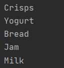

* Rezultat wypisania listy transakcji dla podanego produktu:
 


* Schemat bazy danych

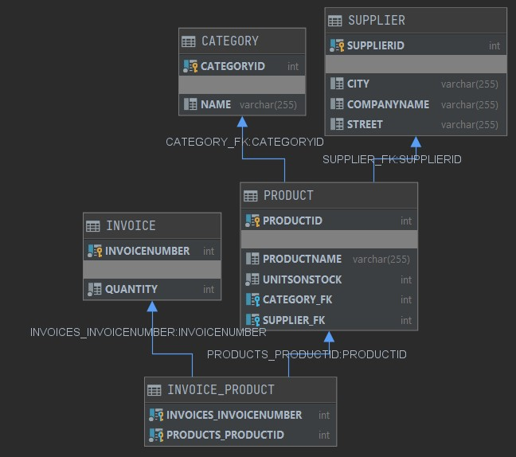

* Definicja bazy:
```sql
create table CATEGORY
(
    CATEGORYID INTEGER not null
        primary key,
    NAME       VARCHAR(255)
);

create table INVOICE
(
    INVOICENUMBER INTEGER not null
        primary key,
    QUANTITY      INTEGER not null
);

create table SUPPLIER
(
    SUPPLIERID  INTEGER not null
        primary key,
    CITY        VARCHAR(255),
    COMPANYNAME VARCHAR(255),
    STREET      VARCHAR(255)
);

create table PRODUCT
(
    PRODUCTID    INTEGER not null
        primary key,
    PRODUCTNAME  VARCHAR(255),
    UNITSONSTOCK INTEGER not null,
    CATEGORY_FK  INTEGER
        constraint FKKRGKXD6GNQYXWWOAOGK95PT3D
            references CATEGORY,
    SUPPLIER_FK  INTEGER
        constraint FKVE96QACVSR1A50RGWL94ENRU
            references SUPPLIER
);

create table INVOICE_PRODUCT
(
    INVOICES_INVOICENUMBER INTEGER not null
        constraint FKCBQYL9U4EH1TWS13U6PK5J2NT
            references INVOICE,
    PRODUCTS_PRODUCTID     INTEGER not null
        constraint FK3OWFENK1TV2NDEPWLTJO1N1G5
            references PRODUCT,
    primary key (INVOICES_INVOICENUMBER, PRODUCTS_PRODUCTID)
);
```

* Select z tabeli _Product_

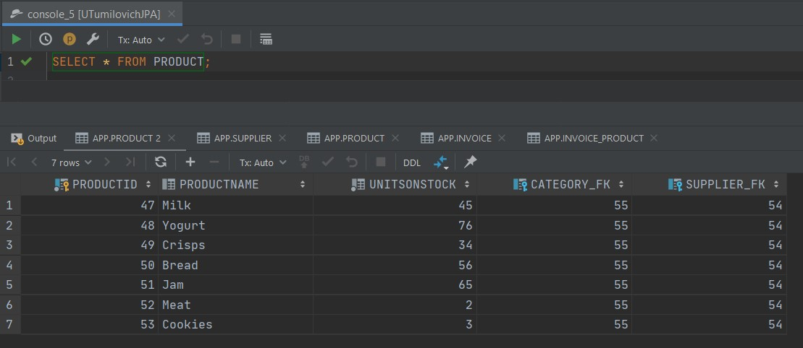

* Select z tabeli _Supplier_

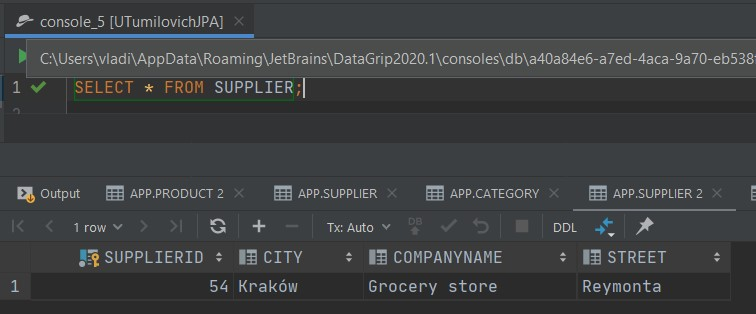

* Select z tabeli _Category_


* Select z tabeli _Invoice_

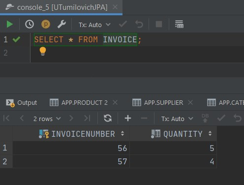

* Select z tabeli _Invoice_Product_


**Zadanie X**

**a)** W folderze _META-INF_ został stworzony plik **persistence.xml**

```xml
<?xml version="1.0"?>
<persistence xmlns="http://java.sun.com/xml/ns/persistence"
             xmlns:xsi="http://www.w3.org/2001/XMLSchema-instance"
             xsi:schemaLocation="http://java.sun.com/xml/ns/persistence
              http://java.sun.com/xml/ns/persistence/persistence_2_0.xsd"
             version="2.0">
    <persistence-unit name="derby" transaction-type="RESOURCE_LOCAL">
        <properties>
            <property name="hibernate.connection.driver_class" value="org.apache.derby.jdbc.ClientDriver"/>
            <property name="hibernate.connection.url" value="jdbc:derby://127.0.0.1/UTumilovichJPA"/>
            <property name="hibernate.show_sql" value="true"/>
            <property name="hibernate.format_sql" value="true"/>
            <property name="hibernate.hbm2ddl.auto" value="create"/>
        </properties>
    </persistence-unit>
</persistence>
```

**b)** Została stworzona nowa klasa **MainJPA** z przykłądowymi obiektami do uzupełnienia bazy

```java
public class MainJPA {
    private static EntityManagerFactory entityManagerFactory;

    private static EntityManager getEntityManager() {
        if (entityManagerFactory == null) {
            entityManagerFactory = Persistence.createEntityManagerFactory("derby");
        }
        return entityManagerFactory.createEntityManager();
    }

    public static void main(String[] argv) {
        EntityManager entityManager = getEntityManager();
        EntityTransaction entityTransaction = entityManager.getTransaction();
        entityTransaction.begin();

        Product product1 = new Product("Filter", 23);
        Product product2 = new Product("Papier", 34);
        Product product3 = new Product("Kubek", 65);

        Supplier supplier = new Supplier("Supplier", "Somewhere", "Anywhere");

        supplier.addProduct(product1);
        supplier.addProduct(product2);
        supplier.addProduct(product3);

        entityManager.persist(product1);
        entityManager.persist(product2);
        entityManager.persist(product3);
        entityManager.persist(supplier);

        entityTransaction.commit();
        entityManager.close();
    }
}
```

**c)** Rezultaty działania programu:
 
* Schemat bazy danych

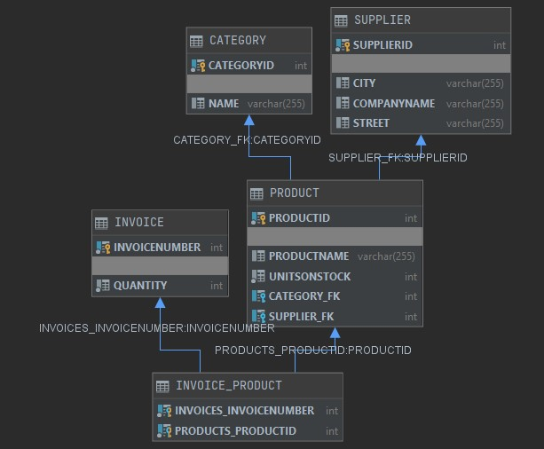

* Definicja bazy:
```sql
create table CATEGORY
(
    CATEGORYID INTEGER not null
        primary key,
    NAME       VARCHAR(255)
);

create table INVOICE
(
    INVOICENUMBER INTEGER not null
        primary key,
    QUANTITY      INTEGER not null
);

create table SUPPLIER
(
    SUPPLIERID  INTEGER not null
        primary key,
    CITY        VARCHAR(255),
    COMPANYNAME VARCHAR(255),
    STREET      VARCHAR(255)
);

create table PRODUCT
(
    PRODUCTID    INTEGER not null
        primary key,
    PRODUCTNAME  VARCHAR(255),
    UNITSONSTOCK INTEGER not null,
    CATEGORY_FK  INTEGER
        constraint FKKRGKXD6GNQYXWWOAOGK95PT3D
            references CATEGORY,
    SUPPLIER_FK  INTEGER
        constraint FKVE96QACVSR1A50RGWL94ENRU
            references SUPPLIER
);

create table INVOICE_PRODUCT
(
    INVOICES_INVOICENUMBER INTEGER not null
        constraint FKCBQYL9U4EH1TWS13U6PK5J2NT
            references INVOICE,
    PRODUCTS_PRODUCTID     INTEGER not null
        constraint FK3OWFENK1TV2NDEPWLTJO1N1G5
            references PRODUCT,
    primary key (INVOICES_INVOICENUMBER, PRODUCTS_PRODUCTID)
);
```

* Select z tabeli _Product_

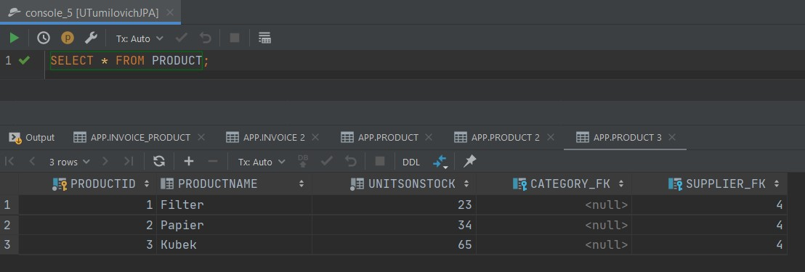

* Select z tabeli _Supplier_


**Zadanie XI**

Zmodyfikowano model w taki sposób, aby było możliwe kaskadowe tworzenie faktur wraz z nowymi produktami oraz produktów wraz z nową fakturą.

**a)** Została zmodyfikowana klasa **Product** dodaniem dodatkowych parametrów polu _invoices_

```java
@Entity
public class Product {
    @Id
    @GeneratedValue(strategy = GenerationType.AUTO)
    private int productId;
    private String productName;
    private int unitsOnStock;

    @ManyToOne
    @JoinColumn(name="Supplier_FK")
    private Supplier supplier;

    @ManyToOne
    @JoinColumn(name="Category_FK")
    private Category category;

    @ManyToMany(mappedBy = "products", fetch = FetchType.EAGER, cascade =  CascadeType.PERSIST)
    private final Set<Invoice> invoices = new HashSet<>();

    public Product() {
    }

    public Product(String productName, int unitsOnStock) {
        this.productName = productName;
        this.unitsOnStock = unitsOnStock;
    }

    public String getProductName() {
        return productName;
    }

    public void setSupplier(Supplier supplier) {
        this.supplier = supplier;
        if (!supplier.getProducts().contains(this)) {
            supplier.addProduct(this);
        }
    }

    public Category getCategory() {
        return category;
    }

    public void setCategory(Category category) {
        this.category = category;
        if (!category.getProducts().contains(this)) {
            category.addProduct(this);
        }
    }

    public Set<Invoice> getInvoices() {
        return invoices;
    }
}
```

**b)** Została zmodyfikowana klasa **Invoices** dodaniem dodatkowych parametrów polu _products_

```java
@Entity
public class Invoice {
    @Id
    @GeneratedValue(strategy = GenerationType.AUTO)
    private int invoiceNumber;
    private int quantity;

    @ManyToMany(cascade = CascadeType.PERSIST)
    private final Set<Product> products = new HashSet<>();

    public Invoice() {
    }

    public Invoice(int quantity) {
        this.quantity = quantity;
    }

    public int getInvoiceNumber() {
        return invoiceNumber;
    }

    public int getQuantity() {
        return quantity;
    }

    public Set<Product> getProducts() {
        return products;
    }

    public void addProduct(Product product) {
        products.add(product);
        product.getInvoices().add(this);
        this.quantity++;
    }
}
```

**c)** Została zmiodyfikowana metoda _main_ klasy **MainJPA** w taki sposób, że po utworzeniu produktów i dodaniu ich do transakcii zostały one nie dodane do bazy

```java
public class MainJPA {
    private static EntityManagerFactory entityManagerFactory;

    private static EntityManager getEntityManager() {
        if (entityManagerFactory == null) {
            entityManagerFactory = Persistence.createEntityManagerFactory("derby");
        }
        return entityManagerFactory.createEntityManager();
    }

    public static void main(String[] argv) {
        EntityManager entityManager = getEntityManager();
        EntityTransaction entityTransaction = entityManager.getTransaction();
        entityTransaction.begin();

        Product newProduct1 = new Product("Milk", 45);
        Product newProduct2 = new Product("Yogurt", 76);
        Product newProduct3 = new Product("Crisps", 34);
        Product newProduct4 = new Product("Bread", 56);
        Product newProduct5 = new Product("Jam", 65);
        Product newProduct6 = new Product("Meat", 2);
        Product newProduct7 = new Product("Cookies", 3);

        Supplier newSupplier = new Supplier("Grocery store", "Reymonta", "Kraków");
        Category newCategory = new Category("Food");
        Invoice newInvoice1 = new Invoice(0);
        Invoice newInvoice2 = new Invoice(0);

        newSupplier.addProduct(newProduct1);
        newSupplier.addProduct(newProduct2);
        newSupplier.addProduct(newProduct3);
        newSupplier.addProduct(newProduct4);
        newSupplier.addProduct(newProduct5);
        newSupplier.addProduct(newProduct6);
        newSupplier.addProduct(newProduct7);

        newCategory.addProduct(newProduct1);
        newCategory.addProduct(newProduct2);
        newCategory.addProduct(newProduct3);
        newCategory.addProduct(newProduct4);
        newCategory.addProduct(newProduct5);
        newCategory.addProduct(newProduct6);
        newCategory.addProduct(newProduct7);

        newInvoice1.addProduct(newProduct1);
        newInvoice1.addProduct(newProduct2);
        newInvoice1.addProduct(newProduct3);
        newInvoice1.addProduct(newProduct4);
        newInvoice1.addProduct(newProduct5);
        newInvoice2.addProduct(newProduct4);
        newInvoice2.addProduct(newProduct5);
        newInvoice2.addProduct(newProduct6);
        newInvoice2.addProduct(newProduct7);

        entityManager.persist(newSupplier);
        entityManager.persist(newCategory);
        entityManager.persist(newInvoice1);
        entityManager.persist(newInvoice2);

        entityTransaction.commit();
        entityManager.close();
    }
}
```

**f)** Rezultaty działania programu:
 
* Schemat bazy danych


* Definicja bazy:
```sql
create table CATEGORY
(
    CATEGORYID INTEGER not null
        primary key,
    NAME       VARCHAR(255)
);

create table INVOICE
(
    INVOICENUMBER INTEGER not null
        primary key,
    QUANTITY      INTEGER not null
);

create table SUPPLIER
(
    SUPPLIERID  INTEGER not null
        primary key,
    CITY        VARCHAR(255),
    COMPANYNAME VARCHAR(255),
    STREET      VARCHAR(255)
);

create table PRODUCT
(
    PRODUCTID    INTEGER not null
        primary key,
    PRODUCTNAME  VARCHAR(255),
    UNITSONSTOCK INTEGER not null,
    CATEGORY_FK  INTEGER
        constraint FKKRGKXD6GNQYXWWOAOGK95PT3D
            references CATEGORY,
    SUPPLIER_FK  INTEGER
        constraint FKVE96QACVSR1A50RGWL94ENRU
            references SUPPLIER
);

create table INVOICE_PRODUCT
(
    INVOICES_INVOICENUMBER INTEGER not null
        constraint FKCBQYL9U4EH1TWS13U6PK5J2NT
            references INVOICE,
    PRODUCTS_PRODUCTID     INTEGER not null
        constraint FK3OWFENK1TV2NDEPWLTJO1N1G5
            references PRODUCT,
    primary key (INVOICES_INVOICENUMBER, PRODUCTS_PRODUCTID)
);
```

* Select z tabeli _Product_


* Select z tabeli _Supplier_


* Select z tabeli _Category_


* Select z tabeli _Invoice_

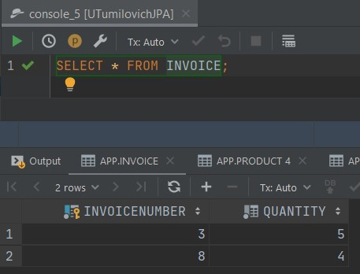

* Select z tabeli _Invoice_Product_


**Zadanie XII**

**a)** Została stworzona klasa **Address** z polami _country_, _city_, _street_, _zipCode_

```java
@Embeddable
public class Address {
    private String country;
    private String city;
    private String street;
    private String zipCode;

    public Address() {
    }

    public Address(String country, String city, String street, String zipCode) {
        this.country = country;
        this.city = city;
        this.street = street;
        this.zipCode = zipCode;
    }
}
```

**b)**  Klasa **Address** została wprowadzona do klasy **Supplier**

```java
@Entity
public class Supplier {
    @Id
    @GeneratedValue(strategy = GenerationType.AUTO)
    private int supplierId;
    private String companyName;

    @Embedded
    private Address address;

    @OneToMany
    @JoinColumn(name="Supplier_FK")
    private final Set<Product> products = new HashSet<>();

    public Supplier() {
    }

    public Supplier(String companyName, Address address) {
        this.companyName = companyName;
        this.address = address;
    }

    public Set<Product> getProducts() {
        return products;
    }

    public void addProduct(Product product) {
        this.products.add(product);
        product.setSupplier(this);
    }
}
```

**c)** Zotali utworzone przykładowe obiekty do zapisywania w bazie w metodzie main klasy **MainJPA**

```java
public class MainJPA {
    private static EntityManagerFactory entityManagerFactory;

    private static EntityManager getEntityManager() {
        if (entityManagerFactory == null) {
            entityManagerFactory = Persistence.createEntityManagerFactory("derby");
        }
        return entityManagerFactory.createEntityManager();
    }

    public static void main(String[] argv) {
        EntityManager entityManager = getEntityManager();
        EntityTransaction entityTransaction = entityManager.getTransaction();
        entityTransaction.begin();

        entityManager.persist(new Supplier("Grocery store",
                new Address("Poland", "Krakow", "Budryka", "30-072")));
        entityManager.persist(new Supplier("Food Supplier",
                new Address("Belarus", "Minsk", "Kammennogorskaya", "220017")));

        entityTransaction.commit();
        entityManager.close();
    }
}
```

**d)** Rezultaty działania programu:
 
* Schemat bazy danych

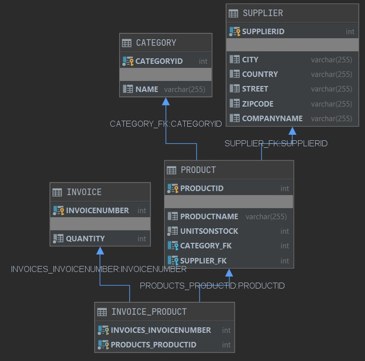

* Definicja bazy:
```sql
create table CATEGORY
(
    CATEGORYID INTEGER not null
        primary key,
    NAME       VARCHAR(255)
);

create table INVOICE
(
    INVOICENUMBER INTEGER not null
        primary key,
    QUANTITY      INTEGER not null
);

create table SUPPLIER
(
    SUPPLIERID  INTEGER not null
        primary key,
    CITY        VARCHAR(255),
    COUNTRY     VARCHAR(255),
    STREET      VARCHAR(255),
    ZIPCODE     VARCHAR(255),
    COMPANYNAME VARCHAR(255)
);

create table PRODUCT
(
    PRODUCTID    INTEGER not null
        primary key,
    PRODUCTNAME  VARCHAR(255),
    UNITSONSTOCK INTEGER not null,
    CATEGORY_FK  INTEGER
        constraint FKKRGKXD6GNQYXWWOAOGK95PT3D
            references CATEGORY,
    SUPPLIER_FK  INTEGER
        constraint FKVE96QACVSR1A50RGWL94ENRU
            references SUPPLIER
);

create table INVOICE_PRODUCT
(
    INVOICES_INVOICENUMBER INTEGER not null
        constraint FKCBQYL9U4EH1TWS13U6PK5J2NT
            references INVOICE,
    PRODUCTS_PRODUCTID     INTEGER not null
        constraint FK3OWFENK1TV2NDEPWLTJO1N1G5
            references PRODUCT,
    primary key (INVOICES_INVOICENUMBER, PRODUCTS_PRODUCTID)
);
```

* Select z tabeli _Supplier_


**e)** Model został zmodyfikowany w taki sposób, że dane adresowe znajdują się w klasie dostawców. Zmapowano do dwóch osobnych tabel.
Klasa **Supplier**

```java
@Entity
@SecondaryTable(name="Address")
public class Supplier {
    @Id
    @GeneratedValue(strategy = GenerationType.AUTO)
    private int supplierId;
    private String companyName;

    @Column(table="Address")
    private String country;
    @Column(table="Address")
    private String city;
    @Column(table="Address")
    private String street;
    @Column(table="Address")
    private String zipCode;

    @OneToMany
    @JoinColumn(name="Supplier_FK")
    private final Set<Product> products = new HashSet<>();

    public Supplier() {
    }

    public Supplier(String companyName, String country, String city, String street, String zipCode) {
        this.companyName = companyName;
        this.country = country;
        this.city = city;
        this.street = street;
        this.zipCode = zipCode;
    }

    public Set<Product> getProducts() {
        return products;
    }

    public void addProduct(Product product) {
        this.products.add(product);
        product.setSupplier(this);
    }
}
```

**f)** Została zmieniona metoda _main_ klasy **MainJPA**

```java
public class MainJPA {
    private static EntityManagerFactory entityManagerFactory;

    private static EntityManager getEntityManager() {
        if (entityManagerFactory == null) {
            entityManagerFactory = Persistence.createEntityManagerFactory("derby");
        }
        return entityManagerFactory.createEntityManager();
    }

    public static void main(String[] argv) {
        EntityManager entityManager = getEntityManager();
        EntityTransaction entityTransaction = entityManager.getTransaction();
        entityTransaction.begin();

        entityManager.persist(new Supplier("Grocery store", "Poland", "Krakow", "Budryka", "30-072"));
        entityManager.persist(new Supplier("Food Supplier", "Belarus", "Minsk", "Kammennogorskaya", "220017"));

        entityTransaction.commit();
        entityManager.close();
    }
}
```

**g)** Rezultaty działania programu:
 
* Schemat bazy danych

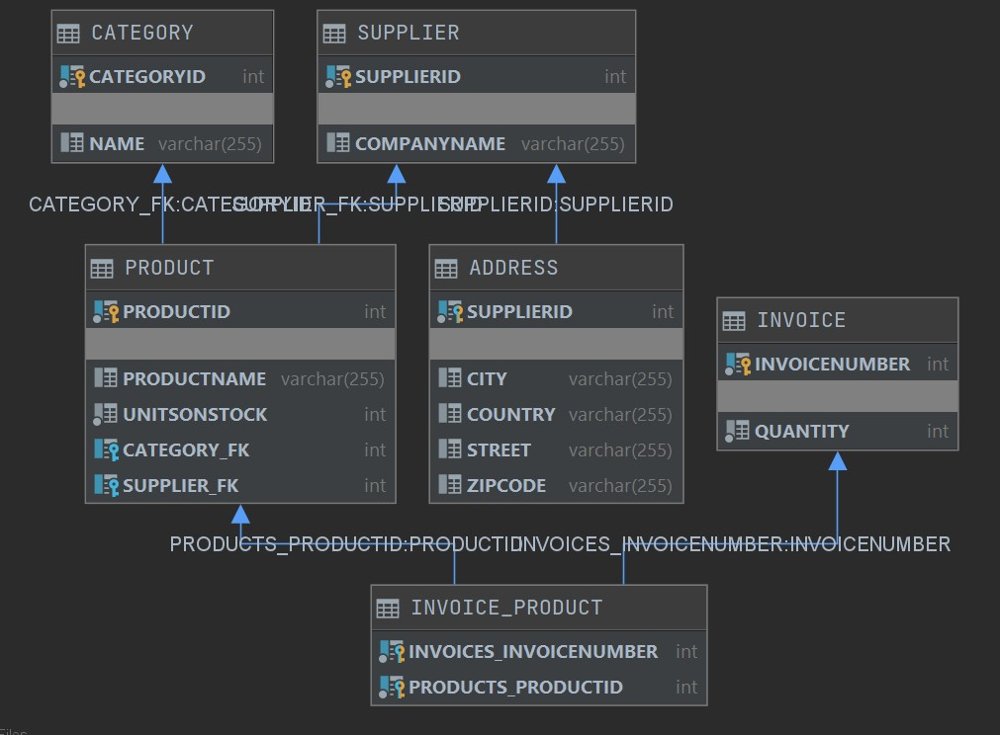

* Definicja bazy:
```sql
create table CATEGORY
(
    CATEGORYID INTEGER not null
        primary key,
    NAME       VARCHAR(255)
);

create table INVOICE
(
    INVOICENUMBER INTEGER not null
        primary key,
    QUANTITY      INTEGER not null
);

create table SUPPLIER
(
    SUPPLIERID  INTEGER not null
        primary key,
    COMPANYNAME VARCHAR(255)
);

create table ADDRESS
(
    CITY       VARCHAR(255),
    COUNTRY    VARCHAR(255),
    STREET     VARCHAR(255),
    ZIPCODE    VARCHAR(255),
    SUPPLIERID INTEGER not null
        primary key
        constraint FKJ5UAJ5TD7CUTXC78VUKFD4A7K
            references SUPPLIER
);

create table PRODUCT
(
    PRODUCTID    INTEGER not null
        primary key,
    PRODUCTNAME  VARCHAR(255),
    UNITSONSTOCK INTEGER not null,
    CATEGORY_FK  INTEGER
        constraint FKKRGKXD6GNQYXWWOAOGK95PT3D
            references CATEGORY,
    SUPPLIER_FK  INTEGER
        constraint FKVE96QACVSR1A50RGWL94ENRU
            references SUPPLIER
);

create table INVOICE_PRODUCT
(
    INVOICES_INVOICENUMBER INTEGER not null
        constraint FKCBQYL9U4EH1TWS13U6PK5J2NT
            references INVOICE,
    PRODUCTS_PRODUCTID     INTEGER not null
        constraint FK3OWFENK1TV2NDEPWLTJO1N1G5
            references PRODUCT,
    primary key (INVOICES_INVOICENUMBER, PRODUCTS_PRODUCTID)
);
```

* Select z tabeli _Supplier_

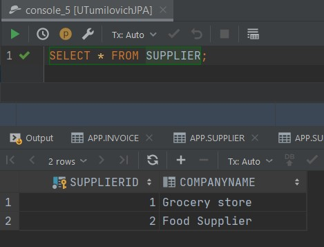
