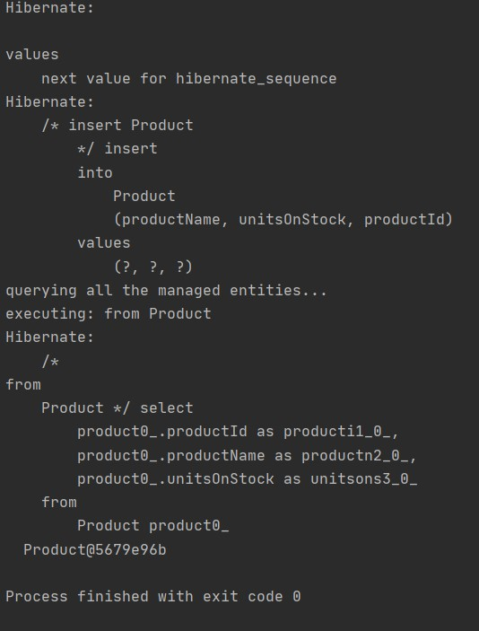
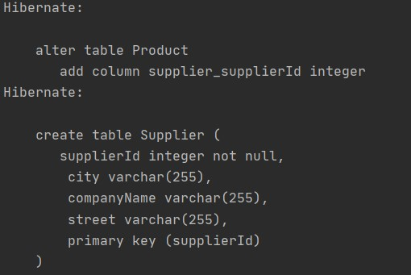
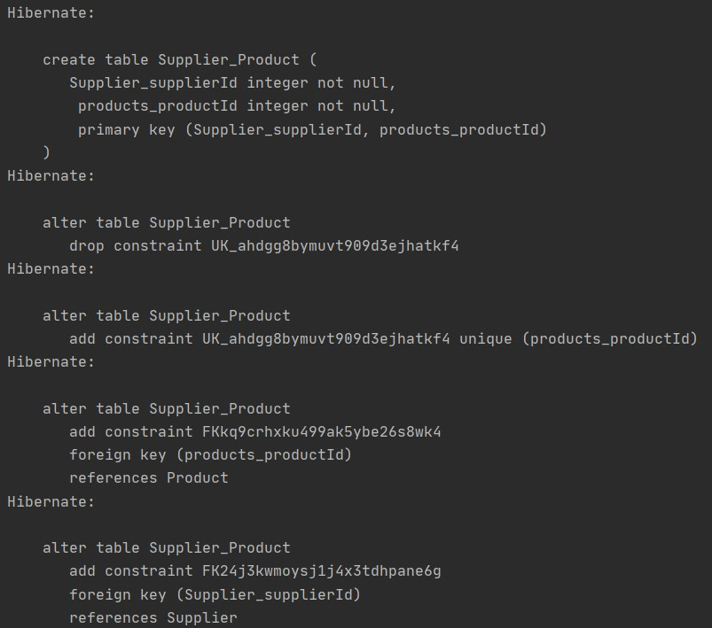

# Hibernate
#### Author: Uladzislau Tumilovich

## Sprawozdanie

**Zadanie II. Basics**

**a) - h)** Został uruchomiony server Derby. W konsli ij zostało wywołano polecenie _connect 'jdbc:derby://127.0.0.1/UTumilovichJPA;create=true';_ oraz _show tables;_


**i)** Został stworzony projekt Javowy o nazwie UTumilovichJPAPractice w Intellij

**j) - l)** Została stworzona klasa Product z polami _ProductName_ oraz _UnitsOnStock_. Dodatkowo zostały dołączone potrzebujęce Jar-ki dla uruchomienia projektu

````java
@Entity
public class Product {
    @Id
    @GeneratedValue(strategy = GenerationType.AUTO)
    public int productId;
    public String productName;
    public int unitsOnStock;

    public Product() {
    }

    public Product(String productName, int unitsOnStock) {
        this.productName = productName;
        this.unitsOnStock = unitsOnStock;
    }
}
````

**m)** Zostały uzupełnione potrzebne property w konfiguracji hibernate'a

````java
<?xml version='1.0' encoding='utf-8'?>
<!DOCTYPE hibernate-configuration PUBLIC
        "-//Hibernate/Hibernate Configuration DTD//EN"
        "http://www.hibernate.org/dtd/hibernate-configuration-3.0.dtd">
<hibernate-configuration>
    <session-factory>
        <property name="connection.url">jdbc:derby://127.0.0.1/UTumilovichJPA</property>
        <property name="connection.driver_class">org.apache.derby.jdbc.ClientDriver</property>
        <property name="dialect">org.hibernate.dialect.DerbyTenSevenDialect</property>
        <property name="format_sql">true</property>
        <property name="show_sql">true</property>
        <property name="use_sql_comments">true</property>
        <!-- DB schema will be updated if needed -->
        <property name="hibernate.hbm2ddl.auto">update</property>
        <mapping class="Product"></mapping>
    </session-factory>
</hibernate-configuration>
````

**Zadanie III**

**a)** Został stworzony i dodany do bazy przykładowy produkt w metodzie _main_ classy **Main**

````java
public class Main {
    private static final SessionFactory ourSessionFactory;

    static {
        try {
            Configuration configuration = new Configuration();
            configuration.configure();

            ourSessionFactory = configuration.buildSessionFactory();
        } catch (Throwable ex) {
            throw new ExceptionInInitializerError(ex);
        }
    }

    public static Session getSession() throws HibernateException {
        return ourSessionFactory.openSession();
    }

    public static void main(final String[] args) throws Exception {
        final Session session = getSession();

        Transaction transaction = session.beginTransaction();
        session.save(new Product("Laptop", 100));
        transaction.commit();

        try {
            System.out.println("querying all the managed entities...");
            final Metamodel metamodel = session.getSessionFactory().getMetamodel();
            for (EntityType<?> entityType : metamodel.getEntities()) {
                final String entityName = entityType.getName();
                final Query query = session.createQuery("from " + entityName);
                System.out.println("executing: " + query.getQueryString());
                for (Object o : query.list()) {
                    System.out.println("  " + o);
                }
            }
        } finally {
            session.close();
        }
    }
}
````

**b)** Rezultaty działania programu:

* Informacja że tabela została stworzona


* Informacja, że nowy obiekt został dodany do bazy



* Schemat bazy dannych


* Definicja tabeli _Product_ w bazie


* Select z tabeli _Product_


**Zadanie IV**

Został zmodyfikowany model wprowadzeniem pojęcia Dostawcy ja poniżej


**a)** Najpierw została stworzona klasa **Supplier** z polami _supplierId_, _companyName_, _street_, _city_

````java
@Entity
public class Supplier {
    @Id
    @GeneratedValue(strategy = GenerationType.AUTO)
    private int supplierId;
    private String companyName;
    private String street;
    private String city;

    public Supplier() {
    }

    public Supplier(String companyName, String street, String city) {
        this.companyName = companyName;
        this.street = street;
        this.city = city;
    }
}
````

**b)** Daliej została zmodyfikowana klasa **Product** dodaniem nowego pola _supplier_ oraz dodatkowymi konstruktorami i metodą _setSupplier_

```` java
@Entity
public class Product {
    @Id
    @GeneratedValue(strategy = GenerationType.AUTO)
    private int productId;
    private String productName;
    private int unitsOnStock;

    @ManyToOne
    private Supplier supplier;

    public Product() {
    }

    public Product(String productName, int unitsOnStock) {
        this.productName = productName;
        this.unitsOnStock = unitsOnStock;
    }

    public Product(String productName, int unitsOnStock, Supplier supplier) {
        this.productName = productName;
        this.unitsOnStock = unitsOnStock;
        this.supplier = supplier;
    }

    public void setSupplier(Supplier supplier) {
        this.supplier = supplier;
    }
}
````

**c)** Następnie do pliku konfiguracyjnego został dodany atrybut _mapping_ po klasie **Supplier**

```` java
<?xml version='1.0' encoding='utf-8'?>
<!DOCTYPE hibernate-configuration PUBLIC
        "-//Hibernate/Hibernate Configuration DTD//EN"
        "http://www.hibernate.org/dtd/hibernate-configuration-3.0.dtd">
<hibernate-configuration>
    <session-factory>
        <property name="connection.url">jdbc:derby://127.0.0.1/UTumilovichJPA</property>
        <property name="connection.driver_class">org.apache.derby.jdbc.ClientDriver</property>
        <property name="dialect">org.hibernate.dialect.DerbyTenSevenDialect</property>
        <property name="format_sql">true</property>
        <property name="show_sql">true</property>
        <property name="use_sql_comments">true</property>
        <!-- DB schema will be updated if needed -->
        <property name="hibernate.hbm2ddl.auto">update</property>
        <mapping class="Product"></mapping>
        <mapping class="Supplier"></mapping>
    </session-factory>
</hibernate-configuration>
````

**d)** Na koniec została zmodyfikowna metoda _main_ klasy **Main** na dodanie nowego dostawcy oraz połączenie pola _supplier_ istniejącego produktu z dodanym dostawcą

````java
public class Main {
    private static final SessionFactory ourSessionFactory;

    static {
        try {
            Configuration configuration = new Configuration();
            configuration.configure();

            ourSessionFactory = configuration.buildSessionFactory();
        } catch (Throwable ex) {
            throw new ExceptionInInitializerError(ex);
        }
    }

    public static Session getSession() throws HibernateException {
        return ourSessionFactory.openSession();
    }

    public static void main(final String[] args) throws Exception {
        final Session session = getSession();

        Transaction transaction = session.beginTransaction();
        Product product = session.get(Product.class, 1);
        Supplier supplier = new Supplier("Supplier", "Somewhere", "Anywhere");
        product.setSupplier(supplier);
        session.save(supplier);
        session.save(product);
        transaction.commit();

        try {
            System.out.println("querying all the managed entities...");
            final Metamodel metamodel = session.getSessionFactory().getMetamodel();
            for (EntityType<?> entityType : metamodel.getEntities()) {
                final String entityName = entityType.getName();
                final Query query = session.createQuery("from " + entityName);
                System.out.println("executing: " + query.getQueryString());
                for (Object o : query.list()) {
                    System.out.println("  " + o);
                }
            }
        } finally {
            session.close();
        }
    }
}
````

**e)** Rezultaty działania programu:

* Informacja że tabela Supplier została stworzona



* Schemat bazy dannych


* Definicja tabeli _Supplier_ w bazie


* Select z tabeli _Product_


* Select z tabeli _Supplier_


**Zadanie V**

Relacja zostałą odwrócona zgodnie z poniższym schematem


**Z tabelą lącznikową**

**a)** Pole _supplier_ oraz wszystkie konstruktory i metody związane z tym polem zostały usunięty z klasy **Product**

````java
@Entity
public class Product {
    @Id
    @GeneratedValue(strategy = GenerationType.AUTO)
    private int productId;
    private String productName;
    private int unitsOnStock;

    public Product() {
    }

    public Product(String productName, int unitsOnStock) {
        this.productName = productName;
        this.unitsOnStock = unitsOnStock;
    }
}
````

**b)** Dalej w klasie **Supplier** zostało dodano pole _Set<Product> products_, dodatkowy konstruktor oraz metoda _addProduct_

````java
@Entity
public class Supplier {
    @Id
    @GeneratedValue(strategy = GenerationType.AUTO)
    private int supplierId;
    private String companyName;
    private String street;
    private String city;

    @OneToMany
    private final Set<Product> products = new HashSet<>();

    public Supplier() {
    }

    public Supplier(String companyName, String street, String city) {
        this.companyName = companyName;
        this.street = street;
        this.city = city;
    }

    public Supplier(String companyName, String street, String city, Product product) {
        this.companyName = companyName;
        this.street = street;
        this.city = city;
        this.products.add(product);
    }

    public void addProduct(Product product) {
        this.products.add(product);
    }
}
````

**c)** Na koniec została zmieniona metoda _main_ klasy **Main**

````java
public class Main {
    private static final SessionFactory ourSessionFactory;

    static {
        try {
            Configuration configuration = new Configuration();
            configuration.configure();

            ourSessionFactory = configuration.buildSessionFactory();
        } catch (Throwable ex) {
            throw new ExceptionInInitializerError(ex);
        }
    }

    public static Session getSession() throws HibernateException {
        return ourSessionFactory.openSession();
    }

    public static void main(final String[] args) {
        final Session session = getSession();

        Transaction transaction = session.beginTransaction();

        Product product1 = new Product("Filter", 23);
        Product product2 = new Product("Papier", 34);
        Product product3 = new Product("Kubek", 65);

        Supplier supplier = new Supplier("Supplier", "Somewhere", "Anywhere");

        supplier.addProduct(product1);
        supplier.addProduct(product2);
        supplier.addProduct(product3);

        session.save(product1);
        session.save(product2);
        session.save(product3);
        session.save(supplier);

        transaction.commit();

        try {
            System.out.println("querying all the managed entities...");
            final Metamodel metamodel = session.getSessionFactory().getMetamodel();
            for (EntityType<?> entityType : metamodel.getEntities()) {
                final String entityName = entityType.getName();
                final Query query = session.createQuery("from " + entityName);
                System.out.println("executing: " + query.getQueryString());
                for (Object o : query.list()) {
                    System.out.println("  " + o);
                }
            }
        } finally {
            session.close();
        }
    }
}
````

**d)** Rezultaty działania programu:

* Informacja że tabela Supplier_Product została stworzona



* Schemat bazy dannych


* Definicja tabeli _Supplier_Product_ w bazie


* Select z tabeli _Product_


* Select z tabeli _Supplier_


* Select z tabeli _Supplier_Product_


