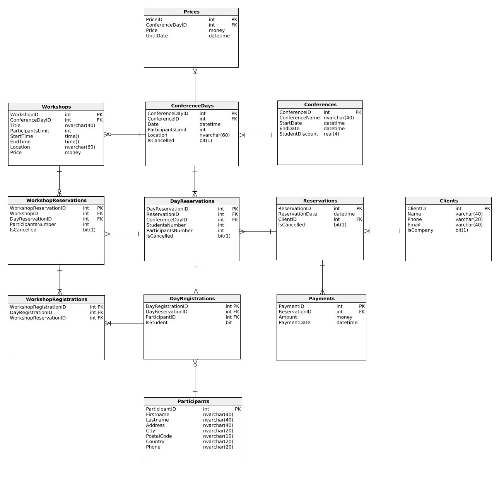

# conference-database

This repository contains implementation of database with the following elements:

* tables
* views
* functions
* procedures
* triggers
* indexes
* generator utilities

The scheme of the database is presented below

This whole project was built with **Tomasz Kozyra**
